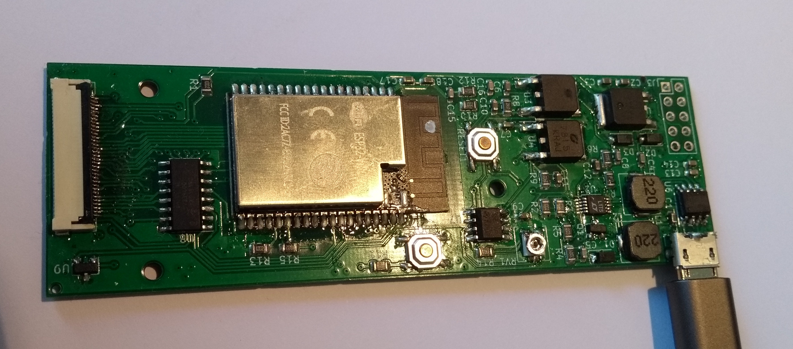
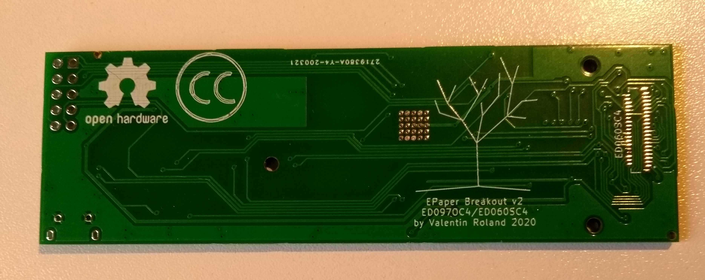

EPDiy E-Paper Driver
=======================================

EPDiy is a driver board which talks to affordable E-Paper (or E-Ink) screens, which are usually sold as replacement screens for E-Book readers. Why are they interesting?

* Easy on the eyes and paper-like aesthetics
* No power consumption when not updating
* Sunlight-readable

Ready-made DIY modules for this size and with 4bpp (16 Grayscale) color support are currently quite expensive. This project uses Kindle replacement screens, which are available for 20$ (small) / 30$ (large) on ebay!

The EPDiy driver board targets multiple E-Paper displays. As the driving method for all matrix-based E-ink displays seems to be more or less the same, only the right connector and timings are needed. The EPDiy PCB features a 33pin and a 39pin connector, which allow to drive the following display types: ED097OC4, ED060SC4, ED097TC2

Displays
--------

| Display  | Size | Resolution | Grey levels | Connector | Bom-Part
| --:      | --:   | --:         | --: | --: | --:                  |
| ED097OC4 | 9.7"  | 1200 x 825  | 16  | 33  | XF2M-3315-1A         |
| ED060SC4 | 6"    | 800 x 600   | 16  | 39  | FH26W-39S-0.3SHW(60) |
| ED097TC2 | 9.7"  | 1200 x 825  | 16  | 33  | XF2M-3315-1A         |
| ED133UT2 | 13.3" | 1600 x 1200 | 16  | 39  | Adapter Board        |

Building It
-----------

If you want to build a board right now, there are two possible routes:
 - Use the new v2 PCB (`hardware/epaper-breakout/gerbers_v4.zip`). This is a bit more fresh, but should work.
   The BOM is available at (`hardware/epaper-breakout/BOM.csv`).
   Positioning files for SMT assembly are available at (`hardware/epaper-breakout/gerbers/epaper-breakout-top-pos.csv`). 
   Please double check the part positioning and Rotation with your assembly service!
 
   Make sure to select the `V4` board revision in `idf.py menuconfig` when building the examples.
 - Use the original v2 PCB (`hardware/epaper-breakout/gerbers_v2_rev0.zip`). 
   However, you might run into issue #3 with some selections of parts.
    
   Make sure to select the `v2/v3` board revision in `idf.py menuconfig` when building the examples.

Gettings Started
----------------

For instructions and more information visit the [documentation](https://epdiy.readthedocs.io/en/latest/getting_started.html)!

Troubleshooting
---------------

The following list is compiled from past experiences and GitHub issues:
 * **The displayed image displays only part of the image.** Make sure to select the correct display type as described [here](https://epdiy.readthedocs.io/en/latest/getting_started.html#selecting-a-display-type).
 * **The existing image fades / darkens when updating a partial screen region.** Make sure the VCOM voltage is [calibrated](https://epdiy.readthedocs.io/en/latest/getting_started.html#calibrate-vcom) for your specific display.
 * **The second third of the image is replaced with the last third.** This seems to be a timing issue we could not yet quite figure out the reason for. For a workarround or suggestions please [join the discussion](https://github.com/vroland/epdiy/issues/15).
 * **The ESP does not boot correctly when external periperals are connected.** Make sure not to pull GPIO12 high during boot, as it is a strapping pin internal voltage selection (https://github.com/vroland/epdiy/issues/17).
 
More on E-Paper Displays
------------------------

 * List of E-Paper devices and their screens: https://e-ink-reader.ru/chg_dsp_en.php (thanks, @mcer12)
 * Reverse engineering of display pins, possible starting point for alternative drivers: https://linux-sunxi.org/PocketBook_Touch_Lux_3 (thanks, @mcer12)
 * Reverse engineering and explanation on driving EPDs: http://essentialscrap.com/eink/index.html
 * Earlier take on driving 6" EPDs with an ESP32, basis of original power circuit: http://spritesmods.com/?art=einkdisplay&page=1
 * Related Hackaday projects: https://hackaday.io/project/21607 https://hackaday.io/project/11537

If you know any other useful resources or have suggestions, please comment on #31!

Hackaday Project
----------------

For more details, see the project page on Hackaday: https://hackaday.io/project/168193-epdiy-976-e-paper-controller

Licenses
--------

The board and schematic are licensed under a  <a rel="license" href="http://creativecommons.org/licenses/by/4.0/">Creative Commons Attribution 4.0 International License</a>.

Firmware and utilities are licensed unter the terms of the MIT license.
